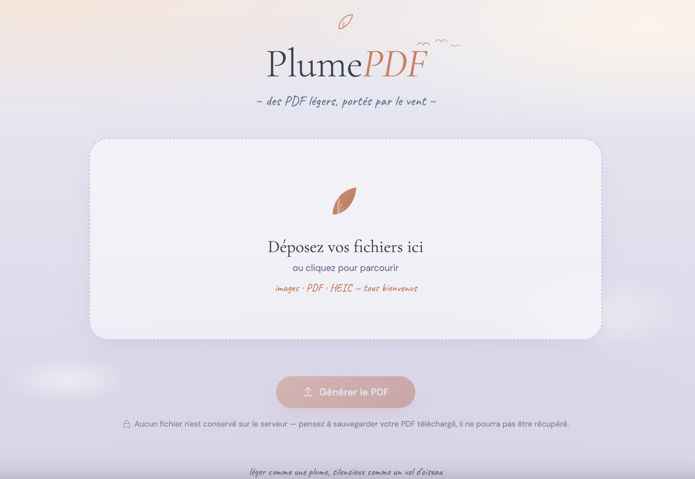

# 🪶 PlumePDF - Compresseur & Convertisseur PDF


> *"Léger comme une plume, silencieux comme un vol d'oiseau"*

**PlumePDF** est un compresseur et convertisseur PDF avec une interface web élégante inspirée des nuages, des plumes et du vol des oiseaux. Conçu pour les serveurs XAMPP/LAMP, il permet de convertir des images (JPG, PNG, HEIC) en PDF et/ou de compresser des PDF existants, le tout directement depuis votre navigateur.



## ✨ Fonctionnalités

- 🪶 **Compression intelligente** : Deux niveaux de compression via Ghostscript
- 🖼️ **Conversion d'images** : JPG, PNG et HEIC/HEIF (photos iPhone) vers PDF
- 📄 **Fusion de PDF** : Combinez plusieurs fichiers en un seul PDF
- 🎨 **Interface épurée** : Design unique inspiré des plumes et du ciel
- 📱 **Responsive** : Fonctionne sur desktop, tablette et mobile
- 🚀 **Drag & Drop** : Glissez-déposez vos fichiers
- 💾 **Téléchargement automatique** : Le PDF généré se télécharge instantanément
- 🔒 **Aucune rétention** : Aucun fichier n'est conservé sur le serveur

## 🖼️ Aperçu

L'interface présente :
- Un design aérien avec nuages animés et plumes flottantes
- Palette de couleurs douces : rose poudré, tons ardoise et cuivre
- Typographie Cormorant Garamond & DM Sans
- Animations fluides et interactions modernes

## 📋 Prérequis

- **Serveur** : XAMPP, WAMP, LAMP ou tout serveur Apache/PHP
- **PHP** : Version 7.4 ou supérieure
- **Ghostscript** : Pour la compression et la fusion PDF
- **ImageMagick** : Pour la conversion d'images (avec support HEIC via libheif)
- **Extensions PHP requises** :
  - `fileinfo`
  - `mbstring`

## 🚀 Installation

### 1. Cloner le dépôt

```bash
cd /path/to/htdocs  # ou /var/www/html sur Linux
git clone https://github.com/sbois/plumepdf.git
cd plumepdf
```

### 2. Installer Ghostscript et ImageMagick (Mac)

```bash
brew install ghostscript
brew install libheif
brew install imagemagick
```

Pour vérifier que les binaires sont bien installés :

```bash
which gs
which magick
```

### 3. Configuration PHP

Éditez votre fichier `php.ini` (généralement `C:\xampp\php\php.ini` ou `/Applications/XAMPP/etc/php.ini`) :

```ini
upload_max_filesize = 64M
post_max_size = 128M
max_file_uploads = 40
max_execution_time = 300
memory_limit = 512M
```

**Important** : Redémarrez Apache après modification du php.ini !

### 4. Accéder à l'application

```
http://localhost/plumepdf/
```

## 📁 Structure du projet

```
plumepdf/
├── index.php      ← Interface utilisateur (HTML/CSS/JS)
├── process.php    ← Backend PHP (conversion & compression)
└── README.md      ← Ce fichier
```

## 🔧 Utilisation

1. **Déposez** vos fichiers (JPG, PNG, HEIC/HEIF, PDF) par glisser-déposer ou via le sélecteur
2. **Cliquez** sur "Générer le PDF"
3. **Choisissez** le niveau de compression :
   - 🪶 **Moyenne** (`/ebook`, ~150 dpi) — qualité préservée, fichier raisonnable
   - 🕊️ **Élevée** (`/screen`, ~72 dpi) — le plus léger, idéal pour l'envoi
4. **Téléchargez** automatiquement votre PDF compressé

## ⚙️ Ce qui se passe sous le capot

- **Images → PDF** : ImageMagick avec `-auto-orient` (respecte l'EXIF des photos iPhone) et `-density 150`
- **Fusion PDF** : Ghostscript (`pdfwrite`, `CompatibilityLevel 1.5`)
- **Compression** : Ghostscript avec `PDFSETTINGS=/ebook` ou `/screen`, polices sous-ensemble, déduplication d'images
- Les fichiers temporaires sont créés dans `tmp/plumepdf_*` et nettoyés automatiquement à la fin de chaque requête

## ⚙️ Configuration

### Modifier les chemins des binaires

Si Ghostscript ou ImageMagick ne sont pas dans un chemin standard, ouvrez `process.php` et ajustez les tableaux `find_binary([...])` en haut du fichier :

```php
// Ajoutez votre chemin en premier dans le tableau
find_binary(['/votre/chemin/gs', '/opt/homebrew/bin/gs', ...])
```

## 🐛 Dépannage

### "Ghostscript introuvable" ou "ImageMagick introuvable"
Les binaires ne sont pas dans un chemin connu. Trouvez-les avec `which gs` et `which magick`, puis ajoutez le chemin complet en tête du tableau `find_binary([...])` dans `process.php`.

### Erreur sur HEIC
ImageMagick doit être compilé avec le support HEIC. Vérifiez avec :
```bash
magick -list format | grep -i heic
```
Si HEIC n'apparaît pas, réinstallez ImageMagick :
```bash
brew install libheif && brew reinstall imagemagick
```

### "Fichier trop volumineux"
Augmentez `upload_max_filesize` et `post_max_size` dans `php.ini`, puis redémarrez Apache.

### Timeout lors de la conversion
Augmentez `max_execution_time` dans `php.ini`.

### Impossible de créer le dossier de travail
Sur macOS avec XAMPP, Apache peut ne pas avoir accès à `/tmp`. Le script tente automatiquement de créer un dossier `tmp/` local au projet. Si le problème persiste :
```bash
mkdir -p /Applications/XAMPP/htdocs/plumepdf/tmp && chmod 777 /Applications/XAMPP/htdocs/plumepdf/tmp
```

## 🤝 Contribution

Les contributions sont les bienvenues ! N'hésitez pas à :

1. Fork le projet
2. Créer une branche (`git checkout -b feature/amelioration`)
3. Commit vos changements (`git commit -m 'Ajout d'une fonctionnalité'`)
4. Push vers la branche (`git push origin feature/amelioration`)
5. Ouvrir une Pull Request

## 📄 Licence

Ce projet est sous licence [GPLv3](LICENSE).

## 👨‍💻 Auteur

Créé avec 🪶 par **Steeve BOIS** à l'aide de Claude AI

## 🙏 Remerciements

- [Ghostscript](https://www.ghostscript.com/) pour la compression et la fusion PDF
- [ImageMagick](https://imagemagick.org/) pour la conversion d'images et le support HEIC
- La communauté PHP pour les ressources et le support

## 📧 Support

Pour toute question ou problème :
- Ouvrez une [issue](https://github.com/sbois/plumepdf/issues)
- Contactez-moi via [https://www.steevebois.com](https://www.steevebois.com)

---

<p align="center">
  <strong>🪶 Léger comme une plume, silencieux comme un vol d'oiseau 🕊️</strong><br>
  Made with ❤️ and ☁️
</p>
